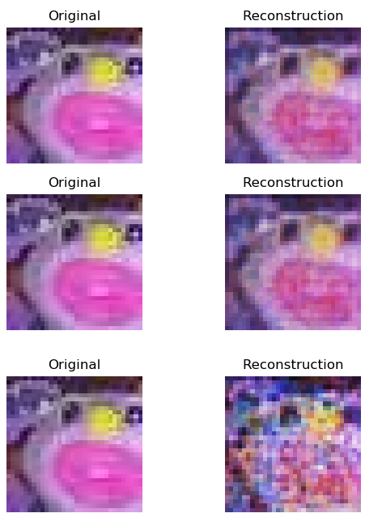

# jpeg-decompressor
jpeg decompressor written in tensorflow

# How does it work?

It's a convolutional network trained on compressed images generated using CIFAR-10 and their uncompressed counterparts. It can be expanded to images past `32x32` by running the decompressor on smaller parts of the larger image you want to decompress.

There are only 2 convolutional layers, we use `elu` activation, maxpooling and batch norm. The final layer is a fully connected layer. A possible (better) architecture could to add a few `conv2d_transpose` layers to reconstruct the image instead of a `fully_connected` layer.

# Why is it so blurry?

Because we're using L2 loss the colors the network tries to output at each pixel for a given image is equivalent to trying to minimize the distance from some mean, it follows a roughly gaussian distribution of colors it can output (and thus they are blurry). One remedy to this is using adversarial loss.

Below are the reconstructions for epoch 25, 40 and 195 respectively.



Another reason the network doesn't really generalize past 90 epochs could be a result of a shallower network capacity.
# Setup

Firstly run
```
mkdir dataset/
mkdir checkpoints/
```

Then install `CIFAR-10` dataset and then drag all the `data_batch_#` files into the `dataset/` directory.

Start the virtual environment

`
virtualenv venv
`

And install the requirements

`pip install -r requirements.txt`

# Training
To train simply run the training script `python train.py`.

During training we tran on a batch size of 500 over 100,000 images with batch shuffling.

# Dependencies

See `requirements.txt`.