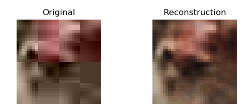

# jpeg-decompressor
a jpeg decompressor written in tensorflow trained on the `CIFAR-10` dataset designed to illustrate how well an autoencoder does at learning to remove compression artifacts generated by the `jpeg` compression algorithm.

# How does it work?

It's a convolutional network trained on compressed images generated using CIFAR-10 and their uncompressed counterparts. It can be expanded to images past `32x32` by running the decompressor on smaller parts of the larger image you want to decompress.

There are only 2 convolutional layers, we use `elu` activation, maxpooling and batch norm. The final layer is a fully connected layer. A possible (better) architecture could to add a few `conv2d_transpose` layers to reconstruct the image instead of a `fully_connected` layer.

The first filter has size 6x6, the next 3x3 and the final filter size 2x2. In hindsight trying to find "compression features" in a space of 6x6 in an area of 32x32 isn't particularly useful, nor is pooling which was removed later on.

# Results

Because we're using L2 loss the colors the network tries to output at each pixel for a given image is equivalent to trying to minimize the distance from some mean, it follows a roughly gaussian distribution of colors it can output (and thus they are blurry). One remedy to this is using adversarial loss.

This [paper](https://arxiv.org/pdf/1501.00092.pdf) suggests removing max-pooling on deep SRCNNs which *likely* contributes to data-loss for neighboring pixels that adds to the unsharpened effect.

Below are the reconstructions for epoch 25, 40 and 195 respectively with pooling (the original architecture) after 10 hours of training.


Increasing the network capacity (depth) may cause it to generalize better, but equivalently also cause it to take longer to learn.
In practice changing the architecture to increase its capacity did not improve the model's ability to generalize to new data.




# Setup

Firstly run
```
mkdir dataset/
mkdir checkpoints/
```

Then install `CIFAR-10` dataset and then drag all the `data_batch_#` files into the `dataset/` directory.

Start the virtual environment

`
virtualenv venv
`

And install the requirements

`pip install -r requirements.txt`

# Training
To train simply run the training script `python train.py`.

During training we train on a batch size of 1000 over 50,000 images with batch shuffling.

# Dependencies

See `requirements.txt`.